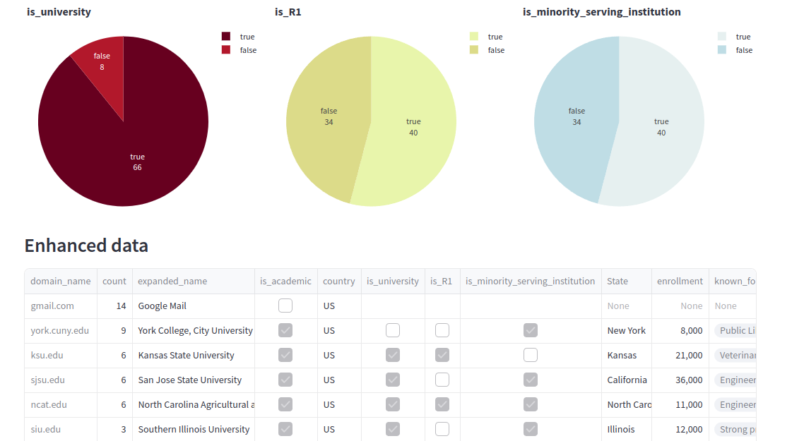
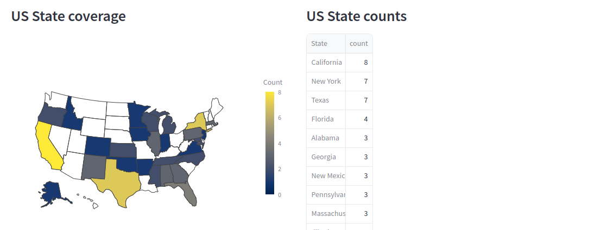

# Inbxo ✨📬

_A simple GPT tool to find out more information from a list of emails. Only uses the domain, the original email address is _not_ saved._

+ 

-----------------------

Built with 💜 by [Travis Hoppe](https://github.com/thoppe/inbxo)